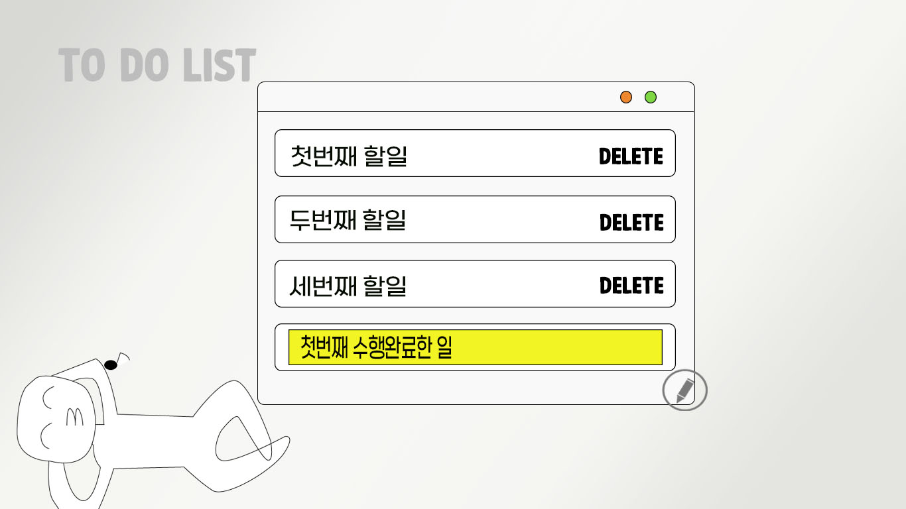

# simple to-do
<a href="https://parkgain.github.io/my-first-web-site/">웹사이트보러가기</a>
 
 
<h4>기술스텍</h4>
<h4>&emsp;HTML, CSS, Javascript</h4>
 

서버에 데이터를 저장하는 동적 웹사이트는 아직 제 실력에는 무리라서 javascript의 localStorage를 사용했습니다.

원래는 Delete 버튼을 누르면 입력창이 아예 사라지고 새로운 입력창을 추가할 수 있도록 하고 싶었으나 그 부분은 공부가 더 필요해서 자바스크립트를 더 공부한 후 구현할 계획입니다. 

다크모드 또한 naver웹사이트에 보면 body 태그에 theme ="dark" 로 다크모드를 구현한 것을 보았는데 그 부분도 좀 더 공부를 하고 구현할 계획입니다.

 
<h4>Website Image</h4>
 

